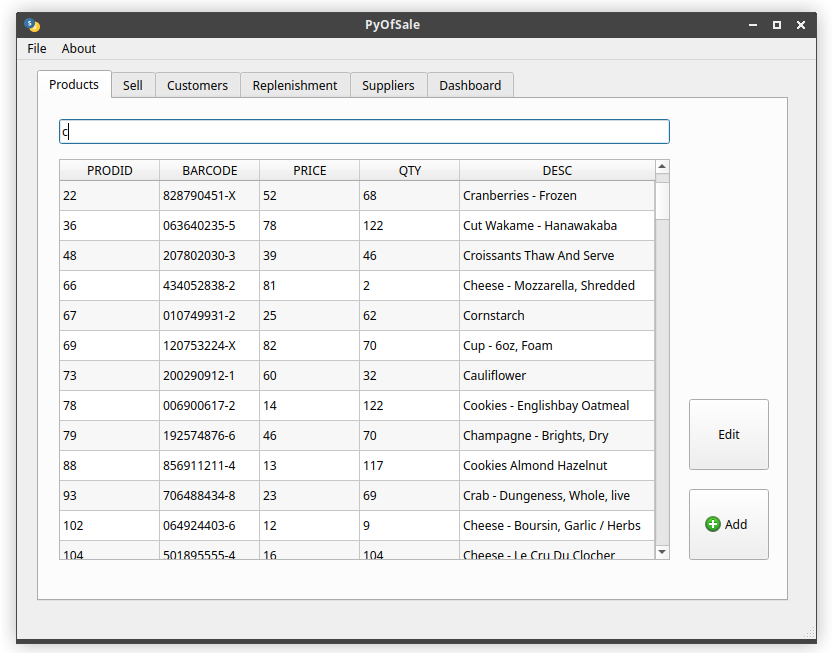

# pyofsale

A simple Point of Sale software made with PyQt5 and SQLite3. Runs in Python3.

New features and bugfixes are coming soon.

### Depends:
- sqlite3
- pyqt5

Both dependencies can be installed with pip3.

---
```
sudo apt update
sudo apt install python3-pip
pip3 install pyqt5
pip3 install sqlite3
git clone https://github.com/nicmorais/pyofsale
cd pyofsale
python3 pyofsale.py
```

 
